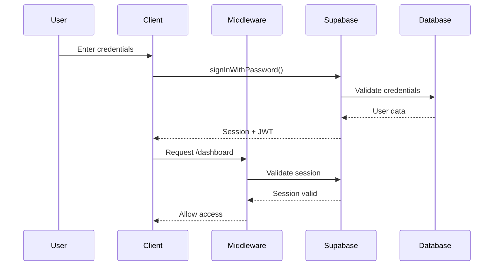

# Authentication Deep Dive

This document provides an in-depth look at the authentication implementation in our TODO application using Supabase Auth.

## Table of Contents

1. [Authentication Architecture](#authentication-architecture)
2. [Session Management](#session-management)
3. [Security Best Practices](#security-best-practices)
4. [Advanced Authentication Patterns](#advanced-authentication-patterns)
5. [Troubleshooting Common Issues](#troubleshooting-common-issues)

## Authentication Architecture

### Overview

Our authentication system is built on three main components:

1. **Supabase Auth Service**: Handles user registration, login, and session management
2. **Next.js Middleware**: Protects routes and manages redirects
3. **Client/Server Utilities**: Separate implementations for different contexts

### Authentication Flow



## Session Management

### How Sessions Work

Supabase uses JWT tokens for session management:

1. **Access Token**: Short-lived token (1 hour default) for API requests
2. **Refresh Token**: Long-lived token for obtaining new access tokens
3. **Session Cookie**: HTTP-only cookie storing both tokens

### Session Refresh Strategy

```typescript
// Automatic session refresh in middleware
const supabase = createServerClient(url, anonKey, {
  cookies: {
    get(name) {
      return request.cookies.get(name)?.value
    },
    set(name, value, options) {
      // Set cookie with appropriate options
      response.cookies.set({
        name,
        value,
        ...options,
        sameSite: 'lax',
        secure: process.env.NODE_ENV === 'production'
      })
    }
  }
})

// Check if session needs refresh
const { data: { session } } = await supabase.auth.getSession()
if (session?.expires_at) {
  const expiresAt = new Date(session.expires_at * 1000)
  const shouldRefresh = expiresAt.getTime() - Date.now() < 60000 // 1 minute
  
  if (shouldRefresh) {
    await supabase.auth.refreshSession()
  }
}
```

### Client vs Server Sessions

**Client-side (Browser)**:
- Uses `createBrowserClient`
- Stores session in localStorage
- Handles token refresh automatically
- Suitable for client components

**Server-side (Next.js)**:
- Uses `createServerClient`
- Reads session from cookies
- Manual session refresh in middleware
- Suitable for server components and API routes

## Security Best Practices

### 1. Password Requirements

Implement strong password policies:

```typescript
const validatePassword = (password: string): string | null => {
  if (password.length < 8) {
    return 'Password must be at least 8 characters long'
  }
  if (!/[A-Z]/.test(password)) {
    return 'Password must contain at least one uppercase letter'
  }
  if (!/[a-z]/.test(password)) {
    return 'Password must contain at least one lowercase letter'
  }
  if (!/[0-9]/.test(password)) {
    return 'Password must contain at least one number'
  }
  if (!/[^A-Za-z0-9]/.test(password)) {
    return 'Password must contain at least one special character'
  }
  return null
}
```

### 2. Rate Limiting

Protect against brute force attacks:

```typescript
// In middleware.ts
const rateLimiter = new Map<string, { count: number; resetTime: number }>()

function checkRateLimit(ip: string): boolean {
  const now = Date.now()
  const limit = rateLimiter.get(ip)
  
  if (!limit || now > limit.resetTime) {
    rateLimiter.set(ip, { count: 1, resetTime: now + 60000 }) // 1 minute window
    return true
  }
  
  if (limit.count >= 5) { // 5 attempts per minute
    return false
  }
  
  limit.count++
  return true
}
```

### 3. CSRF Protection

Supabase handles CSRF protection automatically, but for custom forms:

```typescript
// Generate CSRF token
import { randomBytes } from 'crypto'

export function generateCSRFToken(): string {
  return randomBytes(32).toString('hex')
}

// Validate CSRF token
export function validateCSRFToken(token: string, sessionToken: string): boolean {
  return token === sessionToken
}
```

### 4. Secure Headers

Add security headers in `next.config.ts`:

```typescript
const securityHeaders = [
  {
    key: 'X-DNS-Prefetch-Control',
    value: 'on'
  },
  {
    key: 'Strict-Transport-Security',
    value: 'max-age=63072000; includeSubDomains; preload'
  },
  {
    key: 'X-XSS-Protection',
    value: '1; mode=block'
  },
  {
    key: 'X-Frame-Options',
    value: 'SAMEORIGIN'
  },
  {
    key: 'X-Content-Type-Options',
    value: 'nosniff'
  },
  {
    key: 'Referrer-Policy',
    value: 'origin-when-cross-origin'
  }
]
```

## Advanced Authentication Patterns

### 1. OAuth Providers

Add social login options:

```typescript
// Google OAuth
const handleGoogleLogin = async () => {
  const { error } = await supabase.auth.signInWithOAuth({
    provider: 'google',
    options: {
      redirectTo: `${window.location.origin}/auth/callback`
    }
  })
}

// GitHub OAuth
const handleGitHubLogin = async () => {
  const { error } = await supabase.auth.signInWithOAuth({
    provider: 'github',
    options: {
      redirectTo: `${window.location.origin}/auth/callback`
    }
  })
}
```

### 2. Magic Links

Implement passwordless authentication:

```typescript
const handleMagicLink = async (email: string) => {
  const { error } = await supabase.auth.signInWithOtp({
    email,
    options: {
      emailRedirectTo: `${window.location.origin}/auth/confirm`
    }
  })
  
  if (!error) {
    // Show success message
    setMessage('Check your email for the login link!')
  }
}
```

### 3. Multi-Factor Authentication

Add 2FA for enhanced security:

```typescript
// Enable MFA
const { data, error } = await supabase.auth.mfa.enroll({
  factorType: 'totp'
})

if (data) {
  // Show QR code
  const qrCode = data.totp.qr_code
  const secret = data.totp.secret
}

// Verify MFA
const { data, error } = await supabase.auth.mfa.verify({
  factorId: enrolledFactor.id,
  code: otpCode
})
```

### 4. Session Persistence

Control how sessions are stored:

```typescript
// Configure session persistence
const supabase = createClient(url, key, {
  auth: {
    persistSession: true,
    storageKey: 'todo-app-auth',
    storage: {
      getItem: (key) => {
        if (typeof window !== 'undefined') {
          return window.localStorage.getItem(key)
        }
        return null
      },
      setItem: (key, value) => {
        if (typeof window !== 'undefined') {
          window.localStorage.setItem(key, value)
        }
      },
      removeItem: (key) => {
        if (typeof window !== 'undefined') {
          window.localStorage.removeItem(key)
        }
      }
    }
  }
})
```

### 5. Role-Based Access Control

Implement user roles and permissions:

```sql
-- Create roles table
CREATE TABLE user_roles (
  id UUID DEFAULT gen_random_uuid() PRIMARY KEY,
  user_id UUID REFERENCES auth.users(id) ON DELETE CASCADE,
  role TEXT NOT NULL CHECK (role IN ('user', 'admin', 'moderator')),
  created_at TIMESTAMPTZ DEFAULT NOW()
);

-- Create RLS policies
CREATE POLICY "Users can view their own role" ON user_roles
  FOR SELECT USING (auth.uid() = user_id);

-- Function to check user role
CREATE OR REPLACE FUNCTION user_has_role(required_role TEXT)
RETURNS BOOLEAN AS $$
BEGIN
  RETURN EXISTS (
    SELECT 1 FROM user_roles
    WHERE user_id = auth.uid()
    AND role = required_role
  );
END;
$$ LANGUAGE plpgsql SECURITY DEFINER;
```

## Troubleshooting Common Issues

### 1. Session Expired Errors

**Problem**: Users get logged out unexpectedly

**Solution**:
```typescript
// Add session monitoring
useEffect(() => {
  const { data: { subscription } } = supabase.auth.onAuthStateChange(
    (event, session) => {
      if (event === 'TOKEN_REFRESHED') {
        console.log('Token refreshed successfully')
      }
      if (event === 'SIGNED_OUT') {
        router.push('/login')
      }
    }
  )
  
  return () => subscription.unsubscribe()
}, [])
```

### 2. Cookie Issues

**Problem**: Authentication not working across subdomains

**Solution**:
```typescript
// Set cookie domain in middleware
response.cookies.set({
  name: 'sb-auth-token',
  value: token,
  domain: '.yourdomain.com', // Allow all subdomains
  secure: true,
  sameSite: 'lax'
})
```

### 3. CORS Errors

**Problem**: Authentication requests blocked by CORS

**Solution**:
```typescript
// Configure CORS in Supabase dashboard
// Or add headers in Next.js API routes
export async function POST(request: Request) {
  return new Response(JSON.stringify(data), {
    headers: {
      'Content-Type': 'application/json',
      'Access-Control-Allow-Origin': process.env.NEXT_PUBLIC_APP_URL!,
      'Access-Control-Allow-Credentials': 'true'
    }
  })
}
```

### 4. Redirect Loops

**Problem**: Infinite redirects between login and protected pages

**Solution**:
```typescript
// Add redirect prevention in middleware
const isAuthPage = request.nextUrl.pathname.startsWith('/login') ||
                  request.nextUrl.pathname.startsWith('/signup')

if (!user && !isAuthPage) {
  return NextResponse.redirect(new URL('/login', request.url))
}

if (user && isAuthPage) {
  return NextResponse.redirect(new URL('/dashboard', request.url))
}
```

### 5. Email Confirmation Issues

**Problem**: Users not receiving confirmation emails

**Solution**:
1. Check Supabase email settings
2. Verify SMTP configuration
3. Add email to allow list
4. Implement resend functionality:

```typescript
const resendConfirmationEmail = async (email: string) => {
  const { error } = await supabase.auth.resend({
    type: 'signup',
    email,
    options: {
      emailRedirectTo: `${window.location.origin}/auth/confirm`
    }
  })
  
  if (!error) {
    setMessage('Confirmation email resent!')
  }
}
```

## Performance Considerations

### 1. Token Size Optimization

Keep JWT claims minimal:

```typescript
// Good: Only essential claims
const { data, error } = await supabase.auth.updateUser({
  data: { 
    display_name: 'John Doe',
    avatar_url: 'https://...'
  }
})

// Avoid: Large data in JWT
// Store additional data in database instead
```

### 2. Session Caching

Implement session caching to reduce API calls:

```typescript
let cachedSession: Session | null = null
let cacheExpiry: number = 0

export async function getSession(): Promise<Session | null> {
  if (cachedSession && Date.now() < cacheExpiry) {
    return cachedSession
  }
  
  const { data: { session } } = await supabase.auth.getSession()
  if (session) {
    cachedSession = session
    cacheExpiry = Date.now() + 5 * 60 * 1000 // 5 minutes
  }
  
  return session
}
```

### 3. Parallel Authentication Checks

Optimize multiple auth checks:

```typescript
// Instead of sequential checks
const user = await getUser()
const role = await getUserRole(user.id)
const permissions = await getUserPermissions(user.id)

// Use parallel checks
const [user, role, permissions] = await Promise.all([
  getUser(),
  getUserRole(userId),
  getUserPermissions(userId)
])
```

## Summary

This deep dive covered:
- Complete authentication architecture
- Session management strategies
- Security best practices
- Advanced authentication patterns
- Common troubleshooting solutions
- Performance optimizations

Remember, authentication is a critical part of your application. Always:
- Keep dependencies updated
- Monitor for security vulnerabilities
- Test edge cases thoroughly
- Implement proper error handling
- Log authentication events for auditing

For more information, refer to:
- [Supabase Auth Documentation](https://supabase.com/docs/guides/auth)
- [OWASP Authentication Cheat Sheet](https://cheatsheetseries.owasp.org/cheatsheets/Authentication_Cheat_Sheet.html)
- [Next.js Authentication Patterns](https://nextjs.org/docs/authentication)