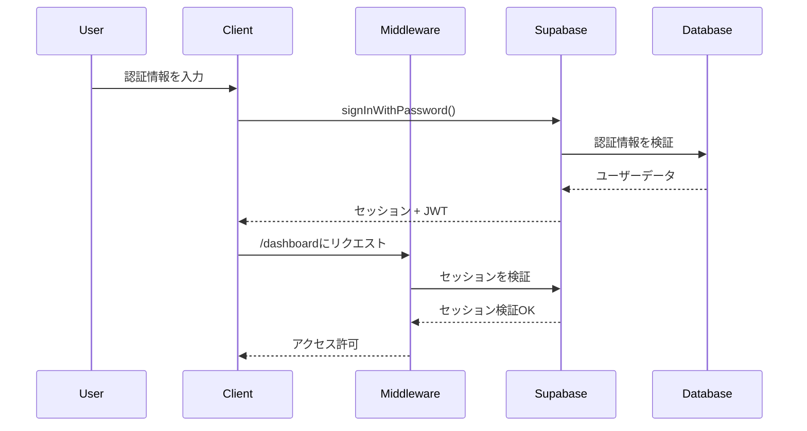

# 認証の詳細解説

このドキュメントでは、Supabase認証を使用したTODOアプリケーションの認証実装について詳しく説明します。

## 目次

1. [認証アーキテクチャ](#認証アーキテクチャ)
2. [セッション管理](#セッション管理)
3. [セキュリティのベストプラクティス](#セキュリティのベストプラクティス)
4. [高度な認証パターン](#高度な認証パターン)
5. [よくある問題のトラブルシューティング](#よくある問題のトラブルシューティング)

## 認証アーキテクチャ

### 概要

私たちの認証システムは3つの主要コンポーネントで構築されています：

1. **Supabase認証サービス**: ユーザー登録、ログイン、セッション管理を処理
2. **Next.jsミドルウェア**: ルートの保護とリダイレクトの管理
3. **クライアント/サーバーユーティリティ**: 異なるコンテキストに対応した個別の実装

### 認証フロー



## セッション管理

### セッションの仕組み

Supabaseはセッション管理にJWTトークンを使用します：

1. **アクセストークン**: APIリクエスト用の短期間有効なトークン（デフォルト1時間）
2. **リフレッシュトークン**: 新しいアクセストークンを取得するための長期間有効なトークン
3. **セッションクッキー**: 両方のトークンを格納するHTTP専用クッキー

### セッションリフレッシュ戦略

```typescript
// ミドルウェアでの自動セッションリフレッシュ
const supabase = createServerClient(url, anonKey, {
  cookies: {
    get(name) {
      return request.cookies.get(name)?.value
    },
    set(name, value, options) {
      // 適切なオプションでクッキーを設定
      response.cookies.set({
        name,
        value,
        ...options,
        sameSite: 'lax',
        secure: process.env.NODE_ENV === 'production'
      })
    }
  }
})

// セッションのリフレッシュが必要かチェック
const { data: { session } } = await supabase.auth.getSession()
if (session?.expires_at) {
  const expiresAt = new Date(session.expires_at * 1000)
  const shouldRefresh = expiresAt.getTime() - Date.now() < 60000 // 1分
  
  if (shouldRefresh) {
    await supabase.auth.refreshSession()
  }
}
```

### クライアントサイド vs サーバーサイドセッション

**クライアントサイド（ブラウザ）**:
- `createBrowserClient`を使用
- セッションをlocalStorageに保存
- トークンのリフレッシュを自動処理
- クライアントコンポーネントに適している

**サーバーサイド（Next.js）**:
- `createServerClient`を使用
- セッションをクッキーから読み取り
- ミドルウェアでのマニュアルセッションリフレッシュ
- サーバーコンポーネントとAPIルートに適している

## セキュリティのベストプラクティス

### 1. パスワード要件

強力なパスワードポリシーを実装する：

```typescript
const validatePassword = (password: string): string | null => {
  if (password.length < 8) {
    return 'パスワードは8文字以上である必要があります'
  }
  if (!/[A-Z]/.test(password)) {
    return 'パスワードには大文字を少なくとも1文字含める必要があります'
  }
  if (!/[a-z]/.test(password)) {
    return 'パスワードには小文字を少なくとも1文字含める必要があります'
  }
  if (!/[0-9]/.test(password)) {
    return 'パスワードには数字を少なくとも1文字含める必要があります'
  }
  if (!/[^A-Za-z0-9]/.test(password)) {
    return 'パスワードには特殊文字を少なくとも1文字含める必要があります'
  }
  return null
}
```

### 2. レート制限

ブルートフォース攻撃から保護する：

```typescript
// middleware.ts内
const rateLimiter = new Map<string, { count: number; resetTime: number }>()

function checkRateLimit(ip: string): boolean {
  const now = Date.now()
  const limit = rateLimiter.get(ip)
  
  if (!limit || now > limit.resetTime) {
    rateLimiter.set(ip, { count: 1, resetTime: now + 60000 }) // 1分間のウィンドウ
    return true
  }
  
  if (limit.count >= 5) { // 1分間に5回まで
    return false
  }
  
  limit.count++
  return true
}
```

### 3. CSRF保護

Supabaseは自動でCSRF保護を処理しますが、カスタムフォームの場合：

```typescript
// CSRFトークンを生成
import { randomBytes } from 'crypto'

export function generateCSRFToken(): string {
  return randomBytes(32).toString('hex')
}

// CSRFトークンを検証
export function validateCSRFToken(token: string, sessionToken: string): boolean {
  return token === sessionToken
}
```

### 4. セキュリティヘッダー

`next.config.ts`でセキュリティヘッダーを追加：

```typescript
const securityHeaders = [
  {
    key: 'X-DNS-Prefetch-Control',
    value: 'on'
  },
  {
    key: 'Strict-Transport-Security',
    value: 'max-age=63072000; includeSubDomains; preload'
  },
  {
    key: 'X-XSS-Protection',
    value: '1; mode=block'
  },
  {
    key: 'X-Frame-Options',
    value: 'SAMEORIGIN'
  },
  {
    key: 'X-Content-Type-Options',
    value: 'nosniff'
  },
  {
    key: 'Referrer-Policy',
    value: 'origin-when-cross-origin'
  }
]
```

## 高度な認証パターン

### 1. OAuthプロバイダー

ソーシャルログインオプションを追加：

```typescript
// Google OAuth
const handleGoogleLogin = async () => {
  const { error } = await supabase.auth.signInWithOAuth({
    provider: 'google',
    options: {
      redirectTo: `${window.location.origin}/auth/callback`
    }
  })
}

// GitHub OAuth
const handleGitHubLogin = async () => {
  const { error } = await supabase.auth.signInWithOAuth({
    provider: 'github',
    options: {
      redirectTo: `${window.location.origin}/auth/callback`
    }
  })
}
```

### 2. マジックリンク

パスワードレス認証を実装：

```typescript
const handleMagicLink = async (email: string) => {
  const { error } = await supabase.auth.signInWithOtp({
    email,
    options: {
      emailRedirectTo: `${window.location.origin}/auth/confirm`
    }
  })
  
  if (!error) {
    // 成功メッセージを表示
    setMessage('ログインリンクをメールで確認してください！')
  }
}
```

### 3. 多要素認証

セキュリティ強化のため2FAを追加：

```typescript
// MFAを有効化
const { data, error } = await supabase.auth.mfa.enroll({
  factorType: 'totp'
})

if (data) {
  // QRコードを表示
  const qrCode = data.totp.qr_code
  const secret = data.totp.secret
}

// MFAを検証
const { data, error } = await supabase.auth.mfa.verify({
  factorId: enrolledFactor.id,
  code: otpCode
})
```

### 4. セッション永続化

セッションの保存方法を制御：

```typescript
// セッション永続化を設定
const supabase = createClient(url, key, {
  auth: {
    persistSession: true,
    storageKey: 'todo-app-auth',
    storage: {
      getItem: (key) => {
        if (typeof window !== 'undefined') {
          return window.localStorage.getItem(key)
        }
        return null
      },
      setItem: (key, value) => {
        if (typeof window !== 'undefined') {
          window.localStorage.setItem(key, value)
        }
      },
      removeItem: (key) => {
        if (typeof window !== 'undefined') {
          window.localStorage.removeItem(key)
        }
      }
    }
  }
})
```

### 5. ロールベースアクセス制御

ユーザーロールと権限を実装：

```sql
-- ロールテーブルを作成
CREATE TABLE user_roles (
  id UUID DEFAULT gen_random_uuid() PRIMARY KEY,
  user_id UUID REFERENCES auth.users(id) ON DELETE CASCADE,
  role TEXT NOT NULL CHECK (role IN ('user', 'admin', 'moderator')),
  created_at TIMESTAMPTZ DEFAULT NOW()
);

-- RLSポリシーを作成
CREATE POLICY "Users can view their own role" ON user_roles
  FOR SELECT USING (auth.uid() = user_id);

-- ユーザーロールをチェックする関数
CREATE OR REPLACE FUNCTION user_has_role(required_role TEXT)
RETURNS BOOLEAN AS $$
BEGIN
  RETURN EXISTS (
    SELECT 1 FROM user_roles
    WHERE user_id = auth.uid()
    AND role = required_role
  );
END;
$$ LANGUAGE plpgsql SECURITY DEFINER;
```

## よくある問題のトラブルシューティング

### 1. セッション期限切れエラー

**問題**: ユーザーが予期せずログアウトされる

**解決策**:
```typescript
// セッション監視を追加
useEffect(() => {
  const { data: { subscription } } = supabase.auth.onAuthStateChange(
    (event, session) => {
      if (event === 'TOKEN_REFRESHED') {
        console.log('トークンが正常にリフレッシュされました')
      }
      if (event === 'SIGNED_OUT') {
        router.push('/login')
      }
    }
  )
  
  return () => subscription.unsubscribe()
}, [])
```

### 2. クッキー問題

**問題**: サブドメイン間で認証が機能しない

**解決策**:
```typescript
// ミドルウェアでクッキードメインを設定
response.cookies.set({
  name: 'sb-auth-token',
  value: token,
  domain: '.yourdomain.com', // すべてのサブドメインで有効
  secure: true,
  sameSite: 'lax'
})
```

### 3. CORSエラー

**問題**: 認証リクエストがCORSによってブロックされる

**解決策**:
```typescript
// Supabaseダッシュボードでコルスを設定
// またはNext.js APIルートでヘッダーを追加
export async function POST(request: Request) {
  return new Response(JSON.stringify(data), {
    headers: {
      'Content-Type': 'application/json',
      'Access-Control-Allow-Origin': process.env.NEXT_PUBLIC_APP_URL!,
      'Access-Control-Allow-Credentials': 'true'
    }
  })
}
```

### 4. リダイレクトループ

**問題**: ログインページと保護されたページ間で無限リダイレクト

**解決策**:
```typescript
// ミドルウェアでリダイレクト防止を追加
const isAuthPage = request.nextUrl.pathname.startsWith('/login') ||
                  request.nextUrl.pathname.startsWith('/signup')

if (!user && !isAuthPage) {
  return NextResponse.redirect(new URL('/login', request.url))
}

if (user && isAuthPage) {
  return NextResponse.redirect(new URL('/dashboard', request.url))
}
```

### 5. メール確認問題

**問題**: ユーザーが確認メールを受信しない

**解決策**:
1. Supabaseのメール設定を確認
2. SMTP設定を検証
3. 許可リストにメールを追加
4. 再送信機能を実装：

```typescript
const resendConfirmationEmail = async (email: string) => {
  const { error } = await supabase.auth.resend({
    type: 'signup',
    email,
    options: {
      emailRedirectTo: `${window.location.origin}/auth/confirm`
    }
  })
  
  if (!error) {
    setMessage('確認メールを再送信しました！')
  }
}
```

## パフォーマンスの考慮事項

### 1. トークンサイズの最適化

JWTクレームを最小限に抑える：

```typescript
// 良い例：必須のクレームのみ
const { data, error } = await supabase.auth.updateUser({
  data: { 
    display_name: 'John Doe',
    avatar_url: 'https://...'
  }
})

// 避けるべき：JWTに大きなデータ
// 代わりに追加データはデータベースに保存
```

### 2. セッションキャッシング

API呼び出しを減らすためのセッションキャッシングを実装：

```typescript
let cachedSession: Session | null = null
let cacheExpiry: number = 0

export async function getSession(): Promise<Session | null> {
  if (cachedSession && Date.now() < cacheExpiry) {
    return cachedSession
  }
  
  const { data: { session } } = await supabase.auth.getSession()
  if (session) {
    cachedSession = session
    cacheExpiry = Date.now() + 5 * 60 * 1000 // 5分
  }
  
  return session
}
```

### 3. 並列認証チェック

複数の認証チェックを最適化：

```typescript
// 逐次チェックの代わりに
const user = await getUser()
const role = await getUserRole(user.id)
const permissions = await getUserPermissions(user.id)

// 並列チェックを使用
const [user, role, permissions] = await Promise.all([
  getUser(),
  getUserRole(userId),
  getUserPermissions(userId)
])
```

## まとめ

この詳細解説では以下を説明しました：
- 完全な認証アーキテクチャ
- セッション管理戦略
- セキュリティのベストプラクティス
- 高度な認証パターン
- よくあるトラブルシューティング解決方法
- パフォーマンス最適化

認証はアプリケーションの重要な部分であることを覚えておいてください。常に：
- 依存関係を最新に保つ
- セキュリティ脆弱性を監視する
- エッジケースを徹底的にテストする
- 適切なエラーハンドリングを実装する
- 監査のため認証イベントをログに記録する

詳細情報については以下を参照してください：
- [Supabase認証ドキュメント](https://supabase.com/docs/guides/auth)
- [OWASP認証チートシート](https://cheatsheetseries.owasp.org/cheatsheets/Authentication_Cheat_Sheet.html)
- [Next.js認証パターン](https://nextjs.org/docs/authentication)